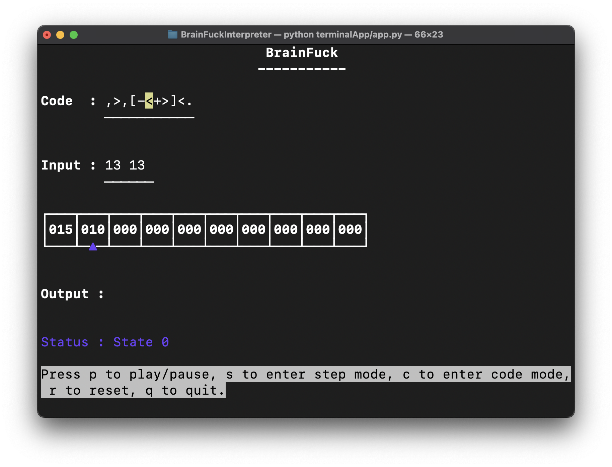

# BrainFuck Interpreter
BrainFuck is an esoteric programming language consisting entirely of 8 characters. The language is designed to be minimalistic and might be the smallest turing complete programming language. It works with a memory pointer and memory array which stores whole number values. The language can actually implement any algorithm that can be implemented in any other programming language (since it is turing complete) but doing it would be just too impractical owing to the lack of abstraction that other languages provide (hence being High Level Programming Languages). 

But this doesn't stop us from taking on the adventure of writing programs in the language just for the sake of it (well, my ego might have been involved when a friend challenged me ;) Anyhow, I liked the language and realised, it could be a great way to learn about computers and their working at the lowest level and also prompt me to think about algorithms differently.

So, began the journey of writing an interpreter for this language. It started with a python script which could take a file, the inputs and run the program. But then I realised that seeing the program actually work and do its little tasks one step at a time might be the way to actually gain the insight this language offers. So, I built the web interface for the same in HTML, CSS and Vanilla Javascript (well we are going minimalist, so vanilla seems only fit). 

This website is aimed to be a nice intro for people to know this language and experiment with it. It comes with a brief introduction to the language, a legend describing the commands and most importantly, it comes preloaded with samples programs to give a taste of the language and to allow people to see it in action. Of course, one can write their own programs and run them too.

## How to use the interpreter
- Python Script
    - Clone the repository
    - Run the python script with the file path as the argument
      ```bash 
        python3 pythonApp/interpreter.py -f <file_path>.bf
        ```
    - Provide the inputs when prompted
    - Or run the script, and paste the code when prompted for it. Similarly for inputs.
      ```bash
        python3 pythonApp/interpreter.py
        ```
- Web Interface
    - Visit the website [here](https://projects.agrimbansal.com/BrainFuckInterpreter) !
    - Write your code in the editor
    - Fill in required inputs separated by space
    - Click on Run and see the code in action
    - You can pause the program, reset it or even change the speed of execution

    

- Terminal App (Update)
    - install the blessed library required for the app.
      ```bash
      pip install blessed
      ```
    - Run the app with python
      ```bash
      python terminalApp/app.py
      ```
    - Enter your code and run. It'll ask for inputs as and when required. Have a look at the commands and detailed instructions written at the very end of the page.

    


## Features
- Code Cleanup (all characters except the 8 commands are ignored and removed at run)
- Light weight web interface.
- Memory Pointer and Memory Array
- Speed Control
- Pause, Step and Reset
- Preloaded Sample Programs
- Input and Output
- Python Script for running the code from terminal

## Some information about the language
- Note : Most interpreters use ASCII characters and values while working with BrainFuck. This interpreter uses integer numbers directly for the sake of transparent understanding.
- The language consists of 8 commands
    - `>` Move the memory pointer to the right
        - So, this basically moves the pointer forward and work on a new memory location. This will be heavily used
    - `<` Move the memory pointer to the left
        - Basically the opposite on the `>` command.
    - `+` Increment the memory value at the pointer
        - This will be used to store values in the memory location. Although it does only increment by 1, it can be used to store any value by incrementing multiple times.
    - `-` Decrement the memory value at the pointer
        - The opposite of the `+` command. This will be used to decrement the value stored in the memory location. Negatives are not allowed and the pointer will wrap around to 255 if decremented from 0.
    - `.` Output the memory value at the pointer
        - Similar to print command, it outputs the value stored at the memory location currently active (where the pointer is at).
    - `,` Input a value and store it at the memory location pointed to
        - This will be used to take input from the user and store it in the memory location overriding any previous data.
    - `[` Jump to the matching `]` if the memory value at the pointer is 0
        - This is essentialy a while loop which will keep executing the code inside the loop until the memory value at the pointer is 0.
    - `]` Jump to the matching `[` if the memory value at the pointer is not 0
        - This is the end of the while loop. If the memory value at the pointer is not 0, the code will jump back to the matching `[` and continue running. (possibly until the end of time)

## Sample Program
- Sum Two Numbers
    - This program will take two inputs and output their sum.
    ```brainfuck
    ,>,<[->+<]>.
    ```
    What this does is it takes two inputs and stores them in the memory locations. Then it decrements the first value and increments the second value until the first value is 0. The output is the sum of the two values. 

    See it in action!


Thank You for bearing with me and reading this far. I hope you enjoy this unique language and the interpreter. 
Feel free to send me any feedback. I would love to hear from you.
Now, go make some programs. Happy Coding! :D
PS: You can try to implement all the sample codes by yourself as a challenge. It will be fun! 


# Update 1
- The project was supposed to be just a script and a webpage but it has evolved. I was, I can't recall why, inspired to make this into a terminal based project as, well, we all developers just love our terminals. And here it is.
- The BrainFuck Interpreter that works right in the terminal and not just compiling the programs but it comes with the visual representation of the working of the program making it super easy to debug and well, pretty looking.

## How to use? 
- The terminal works on the blessed python library which provides the interface for controlling the terminal screen.
So, we do ```pip install blessed``` to install the library.
- Next? There is no next. Just go ```python terminalApp/app.py``` and el voila! You have the terminal based BrainFuck Interpreter running right there.
Note : don't try scrolling. It kinda messes stuff up. It's not a coding problem but stems from the way that the terminal works

## Basic Commands:
- First things first. `q` to quit. This is not vim. I'll let you quit.
- Second, when the program boots up, it is in state 0. which is basically idle state with no data.
- Press `c` to enter code mode. Here, you will type in your code which you want to run. Once finished press enter, program will return to the previous state.
- Whenever the code asks for input, the program enters input state and stays here until you give in the input and press enter.
- Finally, press `p` to run the code. It stands for play. It'll run, take inputs, show outputs and finally end.
- If you want to pause, press `p` and it'll stop right there. Press again to let it continue.
- If you want to reset the program, press `r` and it'll reset the memory-outputs-inputs to the initial state 0.